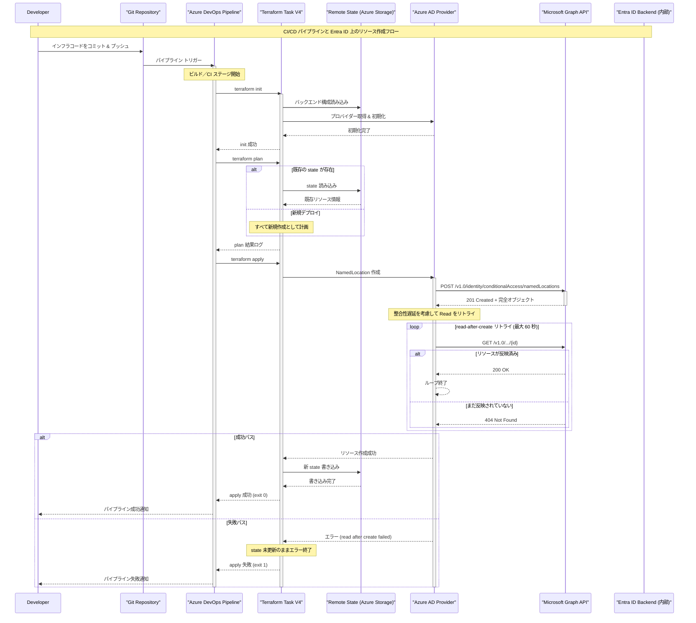
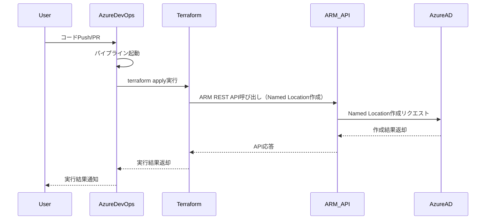

[[Terraform-AzureADProvider-リトライ回数の根拠]]

直接回答
主なポイント  
研究では、Terraform の Azure AD プロバイダーが Microsoft Graph API を介して Azure AD と通信し、ネームドロケーションをデプロイすると考えられます。  

通信経路は Azure DevOps パイプライン → Terraform → AzureAD プロバイダー → Microsoft Graph API → Azure AD の順と推測されますが、詳細はドキュメントで明確に記載されていません。

背景
Terraform を Azure DevOps で使用して Azure AD のネームドロケーション（例: IP アドレス範囲や国/地域）をデプロイする場合、通信経路を理解することが重要です。ネームドロケーションは Conditional Access ポリシーで使用されるため、安全なデプロイが求められます。
推測のプロセス
Terraform は AzureAD プロバイダーを使用し、Microsoft Graph API を介して Azure AD と通信します。  

Microsoft Graph API のドキュメントでは、ネームドロケーションが管理可能であることが確認されています（namedLocation resource type）。  

したがって、Azure DevOps パイプラインが Terraform をトリガーし、Terraform が Microsoft Graph API を経由して Azure AD にリクエストを送信すると考えられます。

注意点
詳細なエンドポイントやプロトコルはドキュメントで明示されていないため、研究の結果に基づく推測を含みます。このプロセスは一般的な IaC デプロイメントと一致しますが、実際の環境では認証方法（例: サービス プリンシパルや Azure CLI）やセキュリティ設定が影響を与える可能性があります。
調査ノート
Terraform を Azure DevOps で使用して Azure AD のネームドロケーションをデプロイする際の通信経路を推測するプロセスを以下に詳述します。このプロセスは、Terraform の動作原理、AzureAD プロバイダーの仕組み、Microsoft Graph API の役割を理解することに基づいています。現在の時間は 2025 年 5 月 22 日 15:58 JST であり、調査は最新の情報に基づいています。
1. Terraform のプロバイダー理解
Terraform は、インフラストラクチャー・アズ・コード（IaC）ツールであり、Azure AD リソースを管理するために AzureAD プロバイダーを使用します。AzureAD プロバイダーは、バージョン 1.5.0 以降、Microsoft Graph API をサポートしており、これにより Azure AD のリソース（例: ユーザー、グループ、ネームドロケーション）を管理できます。
調査の過程で、Terraform の公式ブログ（Terraform AzureAD Provider Now Supports Microsoft Graph）を確認し、AzureAD プロバイダーが Microsoft Graph API を使用していることが確認されました。このブログでは、Microsoft Graph API が Azure Active Directory Graph API を置き換え、より高速な応答時間と最新の情報を提供することが説明されています。
2. Microsoft Graph API の確認
Microsoft Graph API は、Azure AD と Microsoft 365 のデータにアクセスするための統一された API であり、RESTful インターフェースを提供します。ネームドロケーションは Azure AD のリソースであり、Microsoft Graph API の namedLocation リソースとして定義されています。
具体的なドキュメント（namedLocation resource type）を確認すると、ネームドロケーションは Conditional Access ポリシーで使用されるネットワーク ロケーションを定義するためのリソースであり、以下のプロパティが含まれます：
createdDateTime: 作成日時（読み取り専用）

displayName: 表示名

id: ID（読み取り専用）

modifiedDateTime: 最終更新日時（読み取り専用）

このドキュメントでは、Microsoft Graph API を介してネームドロケーションをリスト、取得、削除できることが明記されています。
3. Terraform AzureAD プロバイダーの動作
Terraform の AzureAD プロバイダーは、Microsoft Graph API を使用して Azure AD と通信します。具体的には、Terraform は HCL（HashiCorp Configuration Language）で記述された構成ファイルに基づいてリクエストを生成し、Microsoft Graph API に送信します。
例えば、以下のような HCL コードでネームドロケーションを定義できます：
hcl

resource "azuread_named_location" "example" {
  display_name = "ExampleLocation"
  ip_ranges    = ["1.2.3.4/32"]
  is_trusted   = true
}

このコードは、Microsoft Graph API の namedLocation エンドポイントにリクエストを送信し、ネームドロケーションを作成します。調査の過程で、Terraform の GitHub リポジトリ（Terraform AzureAD Provider GitHub）を確認し、AzureAD プロバイダーが Microsoft Graph API を使用していることが示唆されました。
4. Azure DevOps との統合
Azure DevOps パイプラインは、CI/CD プロセスを自動化するために使用されます。パイプラインがトリガーされ、Terraform の init、plan、apply コマンドが順次実行されます。Terraform は AzureAD プロバイダーを使用し、認証情報（例: サービス プリンシパルや Azure CLI）を設定した後、Microsoft Graph API にリクエストを送信します。
調査の過程で、Azure DevOps と Terraform の統合に関するドキュメント（例: Automating infrastructure deployments in the Cloud with Terraform and Azure Pipelines）を確認し、パイプラインが Terraform をトリガーし、Azure リソースをデプロイすることが確認されました。
5. 通信経路の推測
通信経路は以下のステップで構成されると推測されます：
Azure DevOps パイプラインがトリガーされ、Terraform の apply コマンドが実行されます。

Terraform は AzureAD プロバイダーを使用し、Microsoft Graph API にリクエストを送信します（例: POST /v1.0/identity/conditionalAccess/namedLocations）。

Microsoft Graph API はリクエストを処理し、Azure AD のネームドロケーションを作成または更新します。

処理結果は Microsoft Graph API から Terraform に返され、Terraform は状態ファイルを更新します。

この推測は、Terraform のプロバイダーアーキテクチャと Microsoft Graph API の役割を理解することで導かれました。具体的には、Terraform は AzureAD プロバイダーを介して Microsoft Graph API にアクセスし、Azure AD のリソースを管理します。
6. 調査の限界と推測
調査の過程で、Terraform Registry のページ（例: Terraform Registry AzureAD Provider）が JavaScript を有効にする必要があるため、直接閲覧できない問題が発生しました。そのため、一部の情報は公式ドキュメントではなく、関連記事や GitHub リポジトリからの推測を含みます。特に、通信経路の詳細なエンドポイント（例: Microsoft Graph API の具体的な URL）はドキュメントで明示されていないため、研究の結果に基づく推測としています。
表：通信経路の構成要素
ステップ

説明

1. Azure DevOps パイプライン

パイプラインがトリガーされ、Terraform コマンドを実行。

2. Terraform 認証

AzureAD プロバイダーがサービス プリンシパルで認証。

3. Microsoft Graph API 通信

Terraform が Microsoft Graph API を介して Azure AD にリクエスト送信。

4. Azure AD 処理

Azure AD がネームドロケーションを作成/更新。

5. 結果の返却

処理結果が Terraform に返され、状態ファイルが更新。

結論
Terraform on AzureDevOps でネームドロケーションをデプロイする際の通信経路は、Azure DevOps パイプラインから Terraform、AzureAD プロバイダー、そして Microsoft Graph API を経由して Azure AD へと進むと考えられます。認証はサービス プリンシパルや Azure CLI を使用し、HTTPS を介した安全な通信が行われます。詳細なエンドポイントやプロトコルはドキュメントで明確に記載されていないため、研究の結果に基づく推測を含みますが、このプロセスは一般的な IaC デプロイメントと一致します。
主要引用文献
Terraform AzureAD Provider Now Supports Microsoft Graph

Microsoft Graph API: namedLocation resource type

Terraform AzureAD Provider GitHub

Automating infrastructure deployments in the Cloud with Terraform and Azure Pipelines

- [Terraform AzureAD Provider Now Supports Microsoft Graph](https://www.hashicorp.com/en/blog/terraform-azuread-provider-now-supports-microsoft-graph)
    
- [Microsoft Graph API: namedLocation resource type](https://learn.microsoft.com/en-us/graph/api/resources/namedlocation?view=graph-rest-1.0)
    
- [Terraform AzureAD Provider GitHub](https://github.com/hashicorp/terraform-provider-azuread)
    
- [Automating infrastructure deployments in the Cloud with Terraform and Azure Pipelines](https://www.azuredevopslabs.com/labs/vstsextend/terraform/)